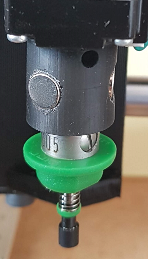

# Juki head magnet holder
> Juki head magnet holder for pick and place machine

This part was printed with SLA 3D printer.

I used Nema 8 motor with 5mm diameter shaft.
Works perfectly even if you probably need runout compensation.

## BOM
- Printed part
- 3x M3x4mm screw
- 3x D6x2mm magnet

## Setting up

- Print part
- M3 tap all the D3 holes
- insert magnet (you should not need glue)

## License

Distributed under the MIT license. See ``LICENSE`` for more information.

